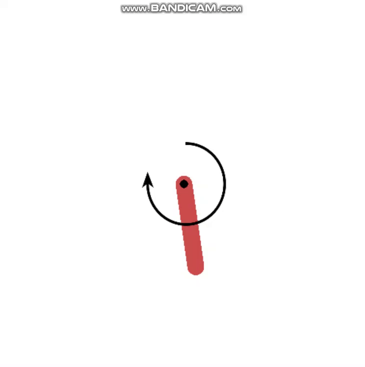

# Fuzzy-Control-Project

Classic PID Controler and Fuzzy PID controler.

## Demo



The Fuzzy Self-Adaptive PID controler has better performance in control problems. Here are some result of the demo.


## Prerequisite

* Python 3.6.8
* Scikit-Fuzzy
* Gym

## Structure

```
/src
    __init__.py
    Fuzzy_PID.py
    PID.py
/scripts
    fuzzy_result.py
    pid_result.py
/test
    *
LICENSE
README.md
.gitignore
```